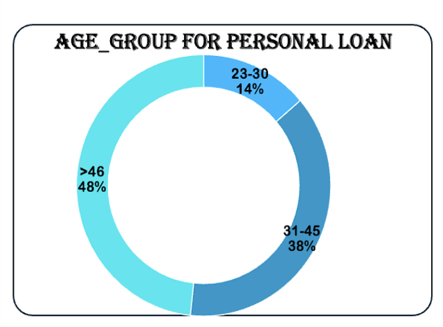

# Loan Analysis Dashboard 📊

## Overview 🏦
This dashboard provides an in-depth analysis of loan distribution, customer demographics, and financial trends. It visualizes key insights related to personal loans, credit card usage, mortgage comparisons, and income levels. The dashboard is designed to help financial analysts understand loan trends and make data-driven decisions.

## Features ✨
- **Total Customers**: Displays the total number of customers in the dataset.
- **Personal Loans & Credit Cards**: Breakdown of customers who have taken personal loans and credit cards.
- **Age Group Analysis**: Distribution of personal loan takers across different age groups.
- **Income vs Loan**: Comparison of income levels and loan approvals.
- **Experience & Income**: Analysis of income based on years of experience.
- **Education Loans**: Number of loans taken across different education levels.
- **Mortgage vs Personal Loan**: Top zip codes where both mortgages and personal loans are taken.
- **Credit Card Users**: Distribution of credit card users by age group.
- **Security & CD Account Loans**: Analysis of loan distribution among customers with security and CD accounts.

## Insights 🔍
- 📌 **Age Group Insights**: Customers above 46 years hold the highest percentage (48%) of personal loans, followed by the 31-45 age group (38%).
- 

- 📌 **Income & Loan Trends**: Customers earning between 94-188K have the highest loan approvals, indicating a strong correlation between mid-to-high income and loan eligibility.
- 📌 **Mortgage & Personal Loan Correlation**: Certain ZIP codes, like 94720 and 94305, have a high number of mortgage holders also opting for personal loans.
- 📌 **Credit Card User Behavior**: Users above 46 years are the dominant credit card holders, indicating a trend toward financial stability and credit usage in older age groups.
- 📌 **Security Account Influence**: Customers with security accounts are more likely to take loans, with 47,492 having security accounts compared to 13,567 without.

## How to Use 📌
1. Open the dashboard in Excel or a visualization tool.
2. Use filters to explore data by ZIP code, family size, and loan type.
3. Analyze loan trends, credit usage, and financial behaviors to derive insights.

## Technologies Used 🛠️
- **Microsoft Excel** (for data visualization)
- **Power BI / Tableau** (optional for interactive dashboards)

## Contributing 🤝
Feel free to raise issues or submit pull requests if you have ideas for improvements!

## License 📜
This project is licensed under the MIT License - see the LICENSE file for details.
